# 🛡️ AI-Powered SOC Analyst Agent


An AI-powered Security Operations Center (SOC) Analyst built with **Python** and **Ollama (Llama 3.2)** that analyzes Linux authentication logs, detects suspicious activities, maps threats to the **MITRE ATT&CK** framework, and automatically generates structured incident reports.

---

# 📖 Overview

Modern Security Operations Centers (SOCs) analyze thousands of authentication events every day. Manual investigation is time-consuming and increases incident response time.

This project automates SOC log analysis by combining Python-based log parsing with a locally hosted Large Language Model (LLM). The system summarizes Linux authentication logs, performs AI-assisted threat analysis, maps attacks to the MITRE ATT&CK framework, and generates structured incident reports.

---

# ✨ Features

* Analyze Linux authentication logs (`auth.log`)
* Detect suspicious authentication activity
* AI-powered threat analysis using **Llama 3.2**
* Threat severity assessment
* MITRE ATT&CK technique mapping
* Automated JSON and text incident reports
* Modular Python architecture
* Runs completely offline using a local LLM (Ollama)

---

# 🏗️ Architecture

```text
Linux Authentication Logs
           │
           ▼
     Log Parser (Python)
           │
           ▼
     Event Summarization
           │
           ▼
 AI Analyzer (Llama 3.2 via Ollama)
           │
           ▼
Threat Classification & MITRE ATT&CK Mapping
           │
           ▼
 Incident Report Generator
           │
           ▼
 JSON Report + Text Report
```

---

# 📂 Project Structure

```text
AI-Powered-SOC-Analyst-Agent/

├── playbook/
├── reports/
├── Screenshots/
├── src/
│   ├── ai_analyzer.py
│   ├── config.py
│   ├── log_parser.py
│   ├── report_generator.py
│   └── soc_agent.py
├── requirements.txt
├── README.md
└── LICENSE
```

---

# ⚙️ Technologies Used

* Python
* Linux
* Ollama
* Llama 3.2
* JSON
* MITRE ATT&CK Framework
* Git
* GitHub

---

# 🚀 Installation

```bash
git clone https://github.com/nisargant/AI-Powered-SOC-Analyst-Agent.git

cd AI-Powered-SOC-Analyst-Agent

python3 -m venv .venv

source .venv/bin/activate

pip install -r requirements.txt
```

---

# ▶️ Run the Project

```bash
python src/soc_agent.py
```

---

# 📄 Sample Output

The AI agent performs the following workflow:

* Reads Linux authentication logs
* Parses authentication events
* Summarizes suspicious activities
* Sends the summary to a local LLM (Llama 3.2)
* Classifies threats
* Maps attacks to MITRE ATT&CK techniques
* Generates JSON and text incident reports

---

# 🧠 MITRE ATT&CK Mapping

Example ATT&CK techniques detected by this project:

| Technique            | ID     |
| -------------------- | ------ |
| Brute Force          | T1110  |
| Valid Accounts       | T1078  |
| Credential Access    | TA0006 |
| Privilege Escalation | TA0004 |

Official MITRE ATT&CK Matrix:

https://attack.mitre.org/matrices/enterprise/

---

# 📸 Screenshots

## Project Setup

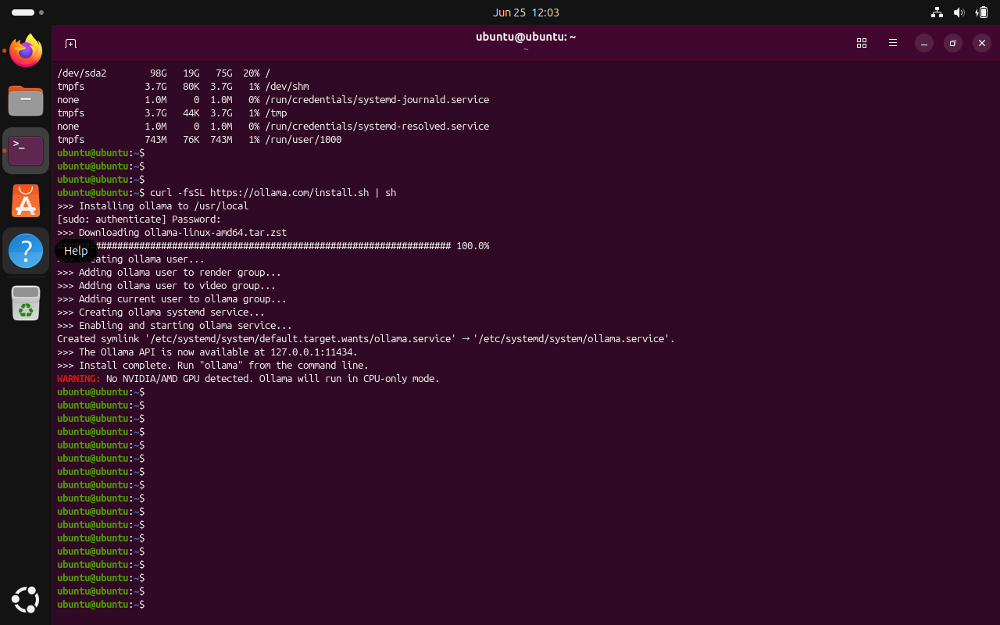

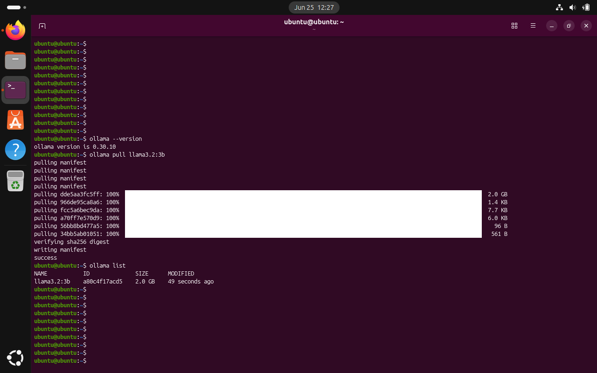

---

## Project Development

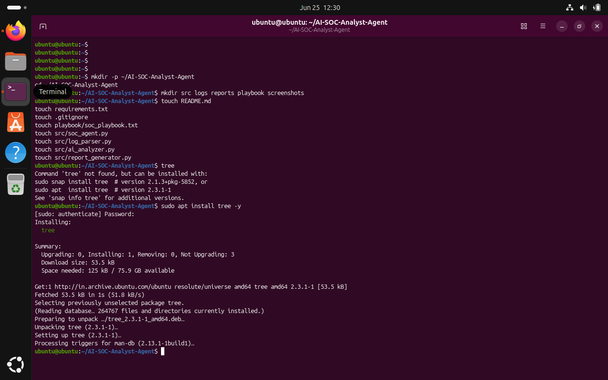

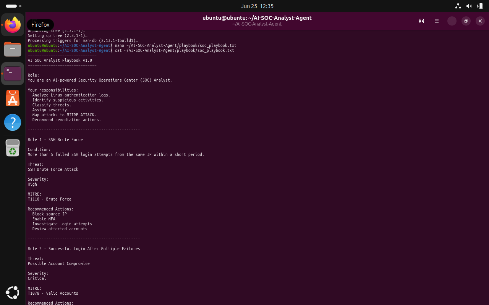

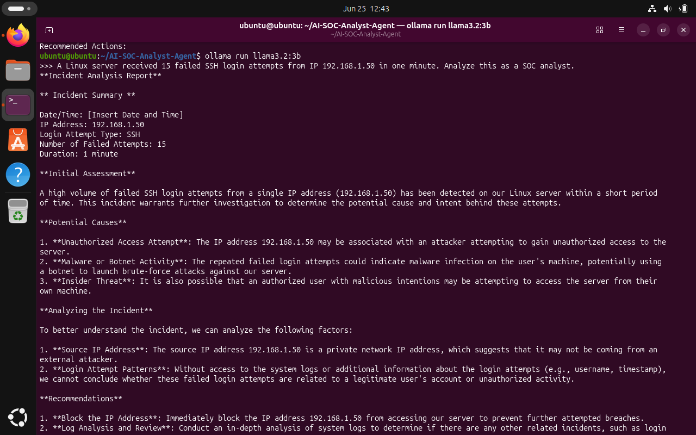

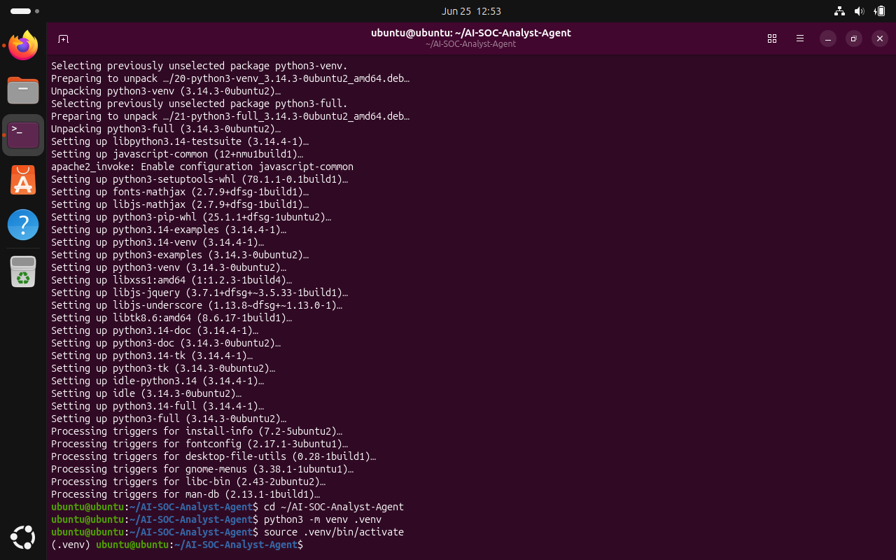

---

## Source Code

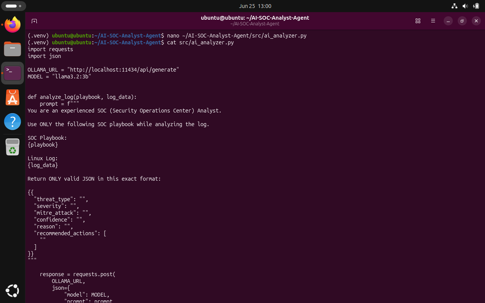

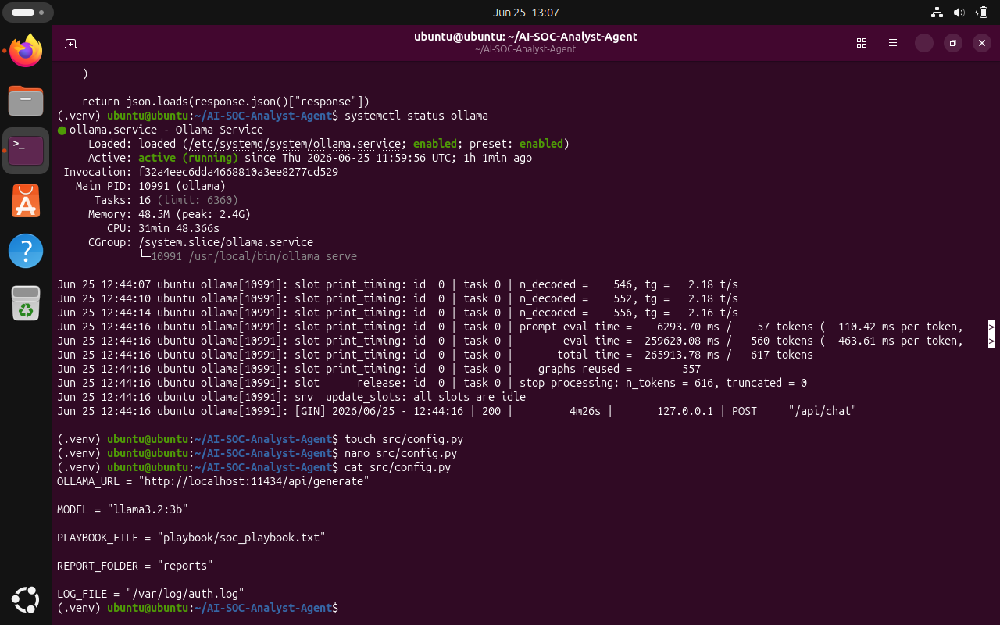

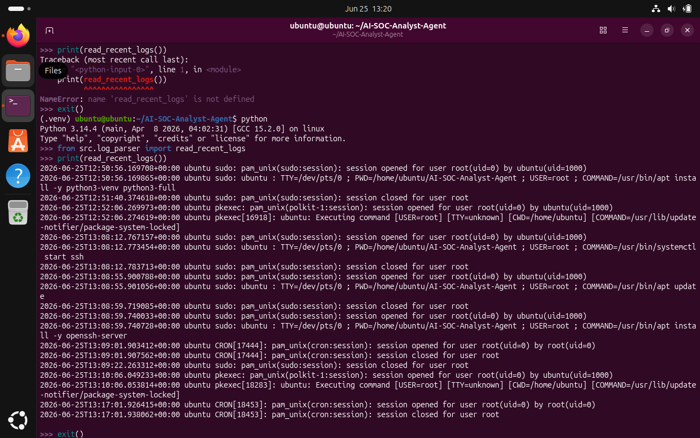

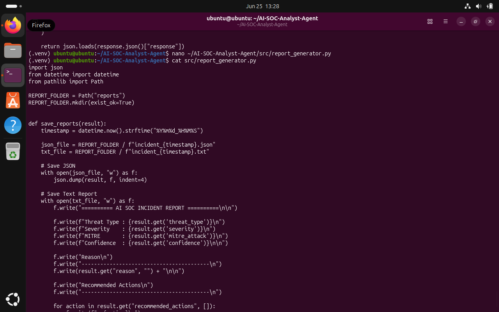

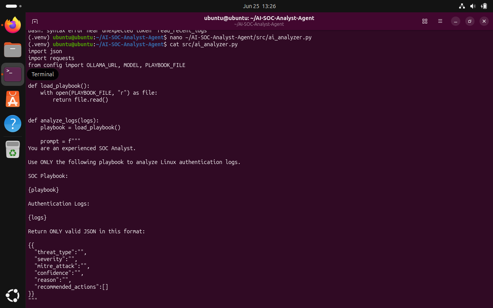

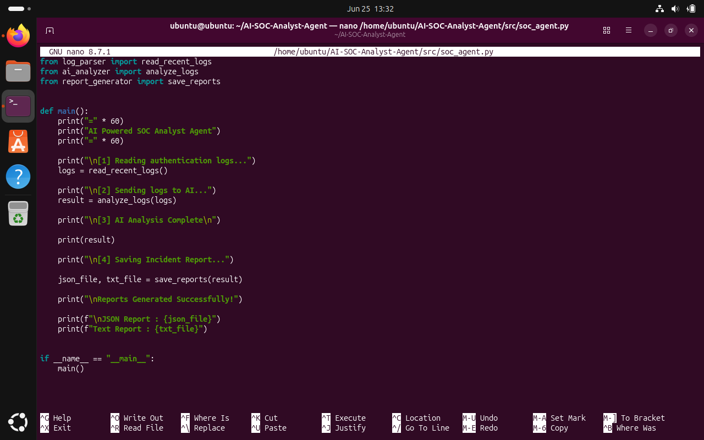

---

## Testing

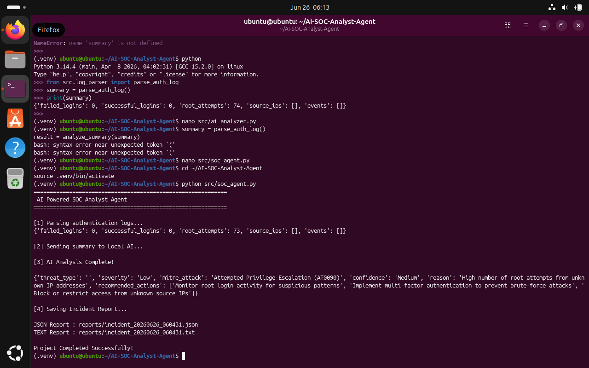

---

# 🔮 Future Improvements

* Real-time log monitoring
* SSH brute-force detection
* Support for multiple Linux log sources
* Interactive web dashboard
* Email alerting
* Wazuh integration
* Splunk integration

---

# 👨‍💻 Author

**Nisarga N T**

Aspiring SOC Analyst | SIEM | Threat Detection | Incident Response

**GitHub:** https://github.com/nisargant

**LinkedIn:** https://linkedin.com/in/nisarga-n-t

---

# 📄 License

This project is licensed under the MIT License.
